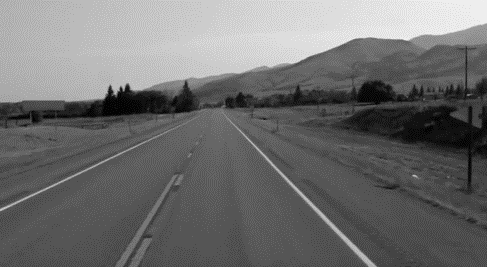
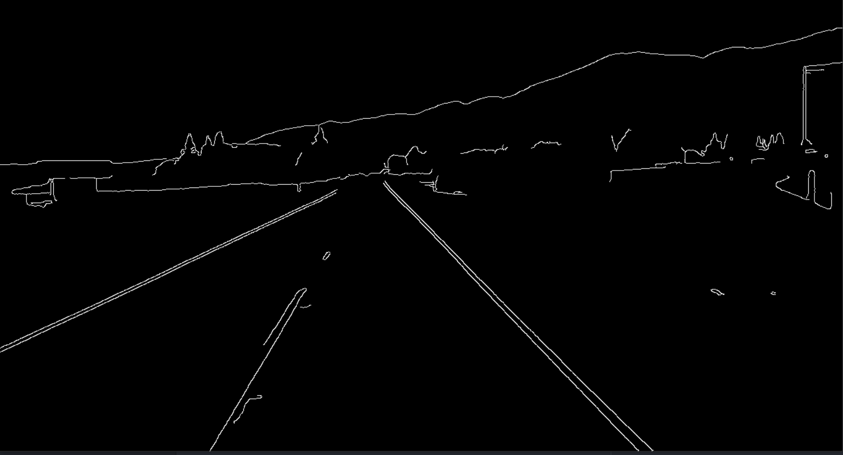
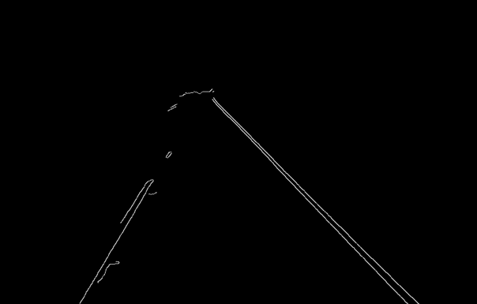
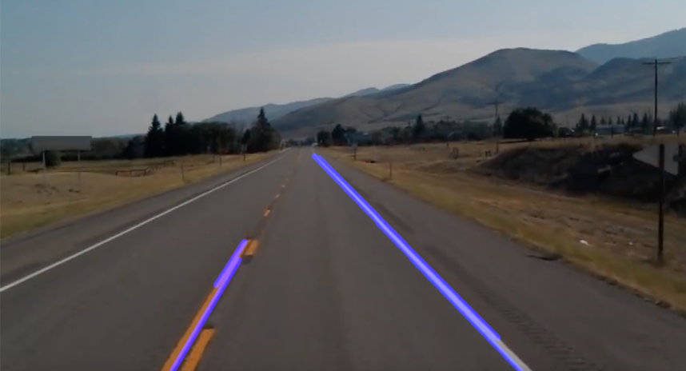
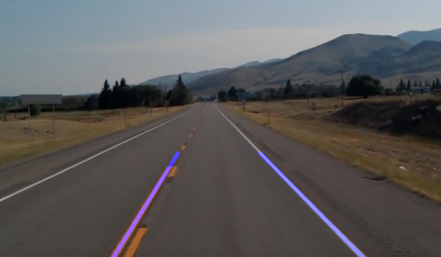

# Using-Computer-Vision-Techniques-with-OpenCV-for-Lane-Detection-in-Autonomous-Vehicles

The purpose of this project is to develop a program that can identify lane markings in images or videos. While humans can use their eyes to determine the location of lane lines while driving, our vehicles lack this type of visual perception capability.

This is where computer vision comes into play, helping computers "see" through complex algorithms. By leveraging computer vision techniques with OpenCV, we can enable autonomous vehicles to detect lane markings effectively.

### Grayscale Conversion

**Grayscale Conversion**

The purpose of edge detection is to identify the boundaries of objects within images. Essentially, I will use edge detection to find areas of sharpness in an image.

### Why Convert an Image to Grayscale?

Images are composed of pixels. A three-channel color image contains red, green, and blue channels. In a grayscale image, each pixel has only one channel and only one intensity value. The absence of color information means less data usage and simpler processing procedures.

  
  
<em>Grayscale applied image</em>

### Gaussian Blur

Image noise can create false edges and ultimately affect edge detection. We need to reduce the noise and smooth our image while detecting edges.

  
  
<em>Gaussian Blur applied image</em>

### Canny Edge Detection

I will use this method to identify edges in the image. An edge corresponds to a region in the image where there is a sharp change in intensity. The Canny function will perform the derivative of our function in both the X and Y directions, measuring the change in intensity relative to neighboring pixels. A small derivative indicates a small change in intensity, while a large derivative indicates a significant change. If the gradient exceeds the upper threshold, it is considered an edge pixel. If it is below the lower threshold, it is rejected.

  
  
<em>Canny applied image</em>

### Region of Interest

Before focusing on how we can identify lane lines, we need to define the region of interest in our image. We will limit the scope of our field of view according to this region of interest. To better explain how to isolate this region, I will use the Matplotlib library. Since it comes with the Anaconda distribution, we should import it into the project. What we need to do is define the function for the region of interest. It should return the closed region of our field of view and be designed to remind us 

  
  
<em>The region of interest was isolated and everything else was masked</em>

### Hough Transformation

Hough Transformation is a technique for detecting straight lines in an image. It creates a probability density space (Hough space) with parameters representing the straight line in the image. This involves a voting process for possible locations of a line for each pixel.

  
  
<em>Using the parameters obtained from the points with the highest votes, lines were drawn onto the original image. These lines represent the lane markings</em>

### Optimization
To perform optimization, the goal is to create a single line by averaging the slopes and y-intercepts of the detected lines. This aims to achieve a clearer and smoother image by using only one line for each lane instead of multiple lines. As a first step, we will calculate the average slope and y-intercept separately for each lane. Then, using these average values, we will create a single line for each lane. This optimized approach will allow us to achieve a more effective result with less complexity.

  
  
<em></em>

### Lane Finding Algorithm in Video
The algorithm developed for detecting lane lines in images has been applied in the same manner to video format. The algorithm has been repeatedly applied to video frames, and the results have been displayed on the screen. Additionally, functionality to press a keyboard key to close the video has been added.
